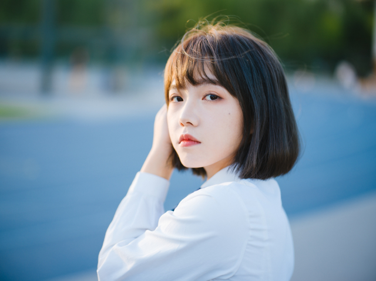
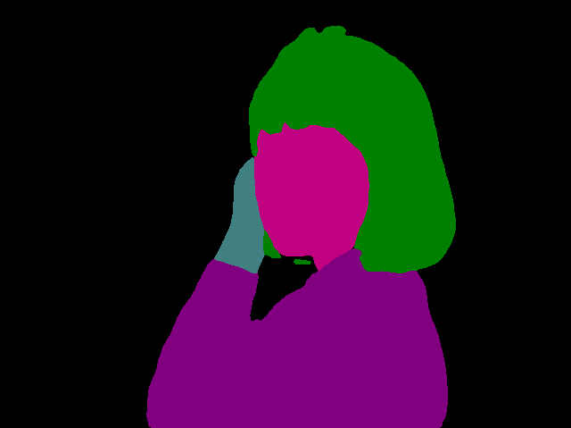
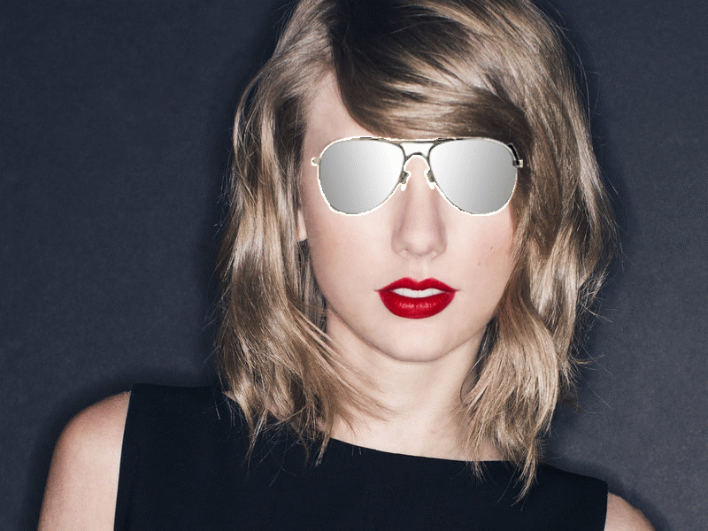
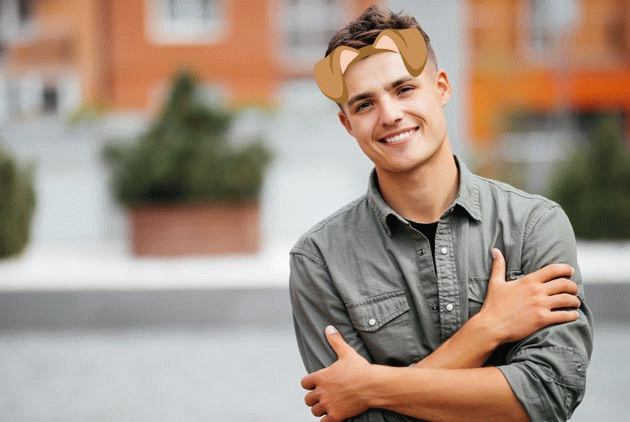

# 使用 PaddleHub 实现有趣的图像效果

提起短视频，应该没有人不知道吧。现在基本上在各个地方都能看得见有人拿着手机在刷短视频。我也玩过短视频，比如抖音，当我在玩抖音时，也尝试了抖音里面的一些特效和道具，感觉很有趣。于是我就想着能不能自己尝试着做出这些效果呢？经过不断地尝试，最终有了这篇文章的内容。

本篇文章将介绍如何使用 PaddleHub 来实现以下效果：

* 变换人体部分的颜色
* 人脸贴纸效果
* 更换视频背景

## PaddleHub 介绍

PaddleHub 便捷地获取 PaddlePaddle 生态下的预训练模型，完成模型的管理和一键预测。配合使用 Fine-tune API，可以基于大规模预训练模型快速完成迁移学习，让预训练模型能更好地服务于用户特定场景的应用。

PaddleHub 有许多学习模型，包括文本、图像和视频。想要了解更多关于 PaddleHub 的内容请访问 [PaddleHub 官方网站](https://www.paddlepaddle.org.cn/hub)。

## 变换人体部分的颜色

> 注：由于现在接口已经更新到 1.1.0 版本，接口发生了变化，该代码仅支持 1.0.0 版本，需要使用下面安装代码进行安装
>
> $ `hub install ace2p==1.0.0`

在 PaddleHub 学习模型中，有一个人体解析的模型，ace2p。人体解析是细粒度的语义分割任务，其旨在识别像素级别的人类图像的组成部分（例如，身体部位和服装）该模型将人体分为 20 个部分，包括头、头发、左手、右手、上衣、裤子等等。更多的内容可以参考[官方模型介绍](https://www.paddlepaddle.org.cn/hubdetail?name=ace2p&en_category=ImageSegmentation)。

这里我只实现了头发和上衣颜色的改变，其他部分原理相同。接下来开始具体实现代码的介绍：

首先，导入相关库

```python
import paddlehub as hub
import cv2
```

然后调用 PaddleHub 检测出给定图像的人体部分，给定图像展示为



```python
img_src = ['origin.jpg']
ace2p = hub.Module(name="ace2p")

# set input dict
input_dict = {"image": img_src}

# execute predict and print the result
results = ace2p.segmentation(data=input_dict)
for result in results:
    print(result['origin'])
    print(result['processed'])
```

PaddleHub 处理后的图像会保存在 `ace2p_output` 文件夹中，指定图像的人体分析效果如下：



接着根据官方指定的人体部分颜色定义一个颜色字典

```python
colors = {
    'background': '#000000',
    'hat': '#800000',
    'hair': '#008000',
    'glove': '#808000',
    'sunglasses': '#000080',
    'upperclothes': '#800080',
    'dress': '#008080',
    'coat': '#808080',
    'socks': '#400000',
    'pants': '#c00000',
    'jumpsuits': '#408000',
    'scarf': '#c08000',
    'skirt': '#400080',
    'face': '#c00080',
    'left-arm': '#408080',
    'right-arm': '#c08080',
    'left-leg': '#004000',
    'right-leg': '#804000',
    'left-shoe': '#00c000',
    'right-shoe': '#80c000',
}
```

在上面指定的颜色中，颜色均为字符串，但是实际在改变颜色时，我们使用的 cv2 的颜色格式，因此需要定义一个颜色格式转换的方法，该方法将三个两位 16 进制的字符串转换为 [0, 255] 之间的一个整数。

```python
def color_str_to_list(color_str):
    return [int(color_str[1:3], 16), int(color_str[3:5], 16), int(color_str[5:7], 16)]
```

然后是变换颜色的方法，该方法输入原始图像和 PaddleHub 进行人体分析后的结果图像，同时指定需要变换颜色的人体部分，以及要改变后的颜色，返回改变颜色后的图像

```python
def change_color(origin_img, mask_img, label, color=None):
    label_mask = mask_img.copy()
    result = origin_img.copy()
    alpha = 0.8  # 可修改，使之看起来更自然
    label_mask[np.where((label_mask != color_str_to_list(colors[label])).any(axis=2))] = [0, 0, 0]
    if not color:
        color = color_str_to_list(colors[label])
    pos = np.where((label_mask == color_str_to_list(colors[label])).all(axis=2))

    for i, j in zip(pos[0], pos[1]):
        result[i][j] = alpha * origin_img[i][j] + (1 - alpha) * np.array(color)

    return result
```

为了展示效果，这里再定义一个随机颜色生成方法

```python
def get_random_color():
    return (randrange(0, 255, 1), randrange(0, 255, 1), randrange(0, 255, 1))
```

在 AIStudio 中不能向本地一样使用 cv2 对图像进行连续展示，因此使用 matplotlib 的 animation 进行动图展示。在以下代码中，对每一帧改变上衣和头发的颜色。

```python
def seg_main():
    img_res = cv2.imread('humanseg_output/origin.png', -1)
    origin = cv2.imread('origin.jpg', cv2.IMREAD_UNCHANGED)
    mask = cv2.imread('ace2p_output/origin_processed.png', cv2.IMREAD_UNCHANGED)
    
    final_list = []
    fig = plt.figure()
    for i in range(50):
        final = change_color(origin, mask, 'upperclothes', get_random_color())
        final = change_color(final, mask, 'hair', get_random_color())
        final = cv2.cvtColor(final, cv2.COLOR_BGRA2RGBA)
        
        im = plt.imshow(final, animated=True)
        plt.axis('off') 
        final_list.append([im])
    return final_list, fig
```

```python
from IPython.display import HTML
import numpy as np
import matplotlib.animation as animation

ims, fig = seg_main()
ani = animation.ArtistAnimation(fig, ims, interval=500, blit=True, repeat_delay=1000)
ani.save("movie.mp4")
HTML(ani.to_html5_video()) 
```

最终效果如下图


## 添加人脸贴纸

这部分主要使用的是 PaddleHub 的人脸关键点检测模型，该模型能够检测到人脸的 68 个关键点，包括人脸轮廓、左右眉毛、左右眼睛、鼻子和嘴巴。具体点的位置如下图


添加贴纸的总体思想都是一样的，这里只对其中一个进行详细说明

### 耳朵贴纸实现过程

1. 读取人脸图像
2. 检测 68 个人脸关键点，检测人脸框
3. 读取贴纸图像（4 通道 png 图像）
4. 计算左眉毛最左边的点和右眉毛最右边的点，通过两点计算角度，作为旋转角度
5. 将贴纸图像旋转上一步获取的角度，同时得到旋转矩阵
6. 在贴纸上取一个点作为参考点（这里取得是贴纸中鼻子的点），用旋转矩阵计算出旋转贴纸中点对应的位置
7. 通过人脸框的宽度将贴纸图像进行尺寸修改，同时计算修改尺寸参考后点的位置
8. 将参考点与人脸的鼻子中的一个点对应进行融合得到最终结果

### 代码详解

首先导入依赖库，定义两个全局变量，LABELS 用于表示人脸的每个部分，COLORS 为了画关键点用于区分，`get_random_color` 方法用于获取随机颜色

```python
import paddlehub as hub
from random import randrange
import math
import numpy as np
import cv2

def get_random_color():
    return randrange(0, 255, 1), randrange(10, 255, 1), randrange(10, 255, 1)


LABELS = ['chin', 'left_eyebrow', 'right_eyebrow', 'nose_bridge',
          'nose_tip', 'left_eye', 'right_eye', 'top_lip', 'bottom_lip']
COLORS = [get_random_color() for _ in LABELS]
```

然后调用 PaddleHub 接口获取人脸关键点

```python
def get_landmarks(img):
    module = hub.Module(name="face_landmark_localization")
    result = module.keypoint_detection(images=[img])
    landmarks = result[0]['data'][0]
    return landmarks
```

由于在贴贴纸时需要根据脸的大小，然后对贴纸的大小进行调节，因此还需要定义获取人脸框的大小的方法，该方法使用了 PaddleHub 中的人脸检测模型。

```python
def get_face_rectangle(img):
    face_detector = hub.Module(name="ultra_light_fast_generic_face_detector_1mb_320")
    result = face_detector.face_detection(images=[img])
    x1 = int(result[0]['data'][0]['left'])
    y1 = int(result[0]['data'][0]['top'])
    x2 = int(result[0]['data'][0]['right'])
    y2 = int(result[0]['data'][0]['bottom'])
    return x1, y1, x2 - x1, y2 - y1
```

为了方便对人脸的每一部分进行处理，这里定义了一个对人脸关键点进行分区的方法，该方法返回人脸每个部分的一个字典。

```python
def face_landmarks(face_image, location_of_face=None):
    landmarks = get_landmarks(face_image)
    landmarks_as_tuples = [[(int(p[0]), int(p[1])) for p in landmarks]]
    return [{
        "chin": points[0:17],
        "left_eyebrow": points[17:22],
        "right_eyebrow": points[22:27],
        "nose_bridge": points[27:31],
        "nose_tip": points[31:36],
        "left_eye": points[36:42],
        "right_eye": points[42:48],
        "top_lip": points[48:55] + [points[64]] + [points[63]] + [points[62]] + [points[61]] + [points[60]],
        "bottom_lip": points[54:60] + [points[48]] + [points[60]] +
                      [points[67]] + [points[66]] + [points[65]] + [points[64]]
    } for points in landmarks_as_tuples]
```

通常情况下，原始图像提供的贴纸都是正视的，但是人脸是有可能倾斜的，因此在贴贴纸时需要将贴纸进行相应角度的倾斜。以下两个方法分别定义了计算倾斜角度的方法和旋转贴纸的方法。

```python
def calculate_angle(point1, point2):
    x1, x2, y1, y2 = point1[0], point2[0], point1[1], point2[1]
    return 180 / math.pi * math.atan((float(y2 - y1)) / (x2 - x1))

def rotate_bound(image, angle):
    (h, w) = image.shape[:2]
    (cX, cY) = (w / 2, h / 2)

    M = cv2.getRotationMatrix2D((cX, cY), -angle, 1.0)
    cos = np.abs(M[0, 0])
    sin = np.abs(M[0, 1])

    nW = int((h * sin) + (w * cos))
    nH = int((h * cos) + (w * sin))

    M[0, 2] += (nW / 2) - cX
    M[1, 2] += (nH / 2) - cY

    return cv2.warpAffine(image, M, (nW, nH)), M
```

最后定义两个方法来实现贴贴纸，`add_sticker` 需要输入原始图像文件路径，贴纸图像的文件路径，贴纸的参考点，贴纸基于人脸大小的比例，需要与贴纸参考点对应的人脸关键点部分。

```python
def add_sticker(img, sticker_name, base_center, ratio, face_part, point_order, extra=[0, 0]):
    sticker = cv2.imread(sticker_name, -1)
    y_top_left, x_top_left, rotated = get_top_left(img, sticker, base_center, ratio, face_part, point_order, extra)
    sticker_h, sticker_w, _ = rotated.shape
    start = 0
    if y_top_left < 0:
        sticker_h = sticker_h + y_top_left
        start = -y_top_left
        y_top_left = 0

    for chanel in range(3):
        img[y_top_left:y_top_left + sticker_h, x_top_left:x_top_left + sticker_w, chanel] = \
            rotated[start:, :, chanel] * (rotated[start:, :, 3] / 255.0) + \
            img[y_top_left:y_top_left + sticker_h, x_top_left:x_top_left + sticker_w, chanel] \
            * (1.0 - rotated[start:, :, 3] / 255.0)

    return img

def get_top_left(img, sticker, base_center, ratio, face_part, point_order, extra=[0, 0]):
    landmarks = face_landmarks(img)
    # check_if_mouth_open(img, landmarks[0])
    angle = calculate_angle(landmarks[0]['left_eyebrow'][0], landmarks[0]['right_eyebrow'][-1])
    nose_tip_center = base_center
    rotated, M = rotate_bound(sticker, angle)
    tip_center_rotate = np.dot(M, np.array([[nose_tip_center[0]], [nose_tip_center[1]], [1]]))
    sticker_h, sticker_w, _ = rotated.shape
    x, y, w, h = get_face_rectangle(img)
    dv = w / sticker_w * ratio
    distance_x, distance_y = int(tip_center_rotate[0] * dv), int(tip_center_rotate[1] * dv)
    rotated = cv2.resize(rotated, (0, 0), fx=dv, fy=dv)
    if len(point_order) == 2:
        y_top_left = (landmarks[0][face_part[0]][point_order[0]][1] + landmarks[0][face_part[1]][point_order[1]][1]) // 2 - distance_y - extra[1]
        x_top_left = (landmarks[0][face_part[0]][point_order[0]][0] + landmarks[0][face_part[1]][point_order[1]][0]) // 2 - distance_x - extra[0]
    else:
        y_top_left = landmarks[0][face_part[0]][point_order[0]][1] - distance_y
        x_top_left = landmarks[0][face_part[0]][point_order[0]][0] - distance_x
    return y_top_left, x_top_left, rotated
```

基于上面两个方法可以实现任意贴纸的效果，只要指定了合适的参考点和对应点。





## 更换视频背景

由于 PaddleHub 目前仅支持图像的分割，因此要进行视频背景替换需要先将视频转换为图像，然后对图像进行背景替换，最后再合成视频。

如果视频过长，可以使用以下代码对视频进行裁剪，或者将视频中不包含人像的时间段裁剪掉，方便提取人像。

```bash
# 裁剪视频
!ffmpeg -i video/01.mp4 -ss 00:00:10 -c copy -t 00:00:20 video/01_cut.mp4 -loglevel quiet
```

然后分别将前景视频和背景视频转换为图像

```bash
# !ffmpeg -ss 00:00:10 -t 0:0:20 -i video/01.mp4 -r 25.0 video/01/out%4d.png\
!mkdir video/01
!ffmpeg -i video/01_cut.mp4 -r 25.0 video/01/out%4d.png -loglevel quiet
```

```bash
!mkdir video/02
!ffmpeg -i video/02.mp4 -r 25.0 video/02/out%4d.png -loglevel quiet
```

之后创建一个文件夹用于存储结果图像集

```bash
!mkdir video/result1
```

最后指向 python 代码进行图像背景替换（图像融合）

> 注意：这里我将 seg 的源码进行了修改，具体参考 [AIStudio](https://aistudio.baidu.com/aistudio/projectdetail/370260) 项目中的代码和介绍

```python
import cv2
import paddlehub as hub
import numpy as np
from PIL import Image

hub.logger.setLevel('ERROR')
module = hub.Module(name="deeplabv3p_xception65_humanseg")
def blend_images(fore_image, base_image, ratio, pos=None):
    """
    将抠出的人物图像换背景
    fore_image: 前景图片，抠出的人物图片
    base_image: 背景图片
    ratio: 调整前景的比例
    pos: 前景放在背景的位置的，格式为左上角坐标
    """
    if isinstance(base_image, str):
        bg_img = cv2.imread(base_image)  # read background image
    else:
        bg_img = base_image
        
    if isinstance(fore_image, str):
        fg_img = cv2.imread(fore_image, -1)  # read foreground image
    else:
        fg_img = fore_image
    height_fg, width_fg, _ = fg_img.shape  # get height and width of foreground image
    height_bg, width_bg, _ = bg_img.shape  # get height and width of background image
    if ratio > (height_bg / height_fg):
        print(f'ratio is too large, use maximum ratio {(height_bg / height_fg): .2}')
        ratio = round((height_bg / height_fg), 1)
    if ratio < 0.1:
        print('ratio < 0.1, use minimum ratio 0.1')
        ratio = 0.1
    # if no pos arg input, use this as default
    if not pos:
        pos = (height_bg - int(ratio * height_fg), width_bg // 4)

    roi = bg_img[pos[0]: pos[0] + int(height_fg * ratio), pos[1] : pos[1]+int(width_fg*ratio)]
    roi = cv2.cvtColor(roi, cv2.COLOR_BGR2RGB)
    if isinstance(fore_image, str):
        fore_image = Image.open(fore_image).resize(roi.shape[1::-1])
    else:
        fore_image = cv2.resize(fore_image, roi.shape[1::-1])

    # 图片加权合成
    scope_map = np.array(fore_image)[:, :, -1] / 255
    scope_map = scope_map[:, :, np.newaxis]
    scope_map = np.repeat(scope_map, repeats=3, axis=2)
    res_image = np.multiply(scope_map, np.array(fore_image)[:, :, 2::-1]) + np.multiply((1 - scope_map), np.array(roi))

    bg_img[pos[0]: pos[0] + roi.shape[0], pos[1]: pos[1] + roi.shape[1]] = np.uint8(res_image)[:, :, ::-1]
    return bg_img

def seg(image, back_img_name):
    input_dict = {"image": [image]}
    result, seg_img = module.segmentation(data=input_dict)
    seg_img = seg_img.astype(np.uint8)
    img = blend_images(seg_img, back_img_name, 1, (0, 0))
    return img
```

```python
import os

fore_path = 'video/01/'
back_path = 'video/02/'

fore_lists = sorted([fore_path + name for name in os.listdir(fore_path)])
back_lists = sorted([back_path + name for name in os.listdir(back_path)])

for i in range(len(back_lists)):
    img = seg(fore_lists[i], back_lists[i])
    cv2.imwrite('video/result1/' + f'{i}'.zfill(4) + '.png', img)
```

如果直接合成的视频是没有音频的，因此为了效果，先提取原始视频中的音频，然后再将音频与该生成视频进行融合。

```bash
# 提取音频
!ffmpeg -i video/01_cut.mp4 video/3.mp3 -loglevel quiet

# 将图像转换为视频
!ffmpeg -f image2 -i video/result/%4d.png -r 25 video/result.mp4 -loglevel quiet

# 添加音频合成视频
!ffmpeg -i video/result.mp4 -i video/3.mp3 -vcodec copy -acodec copy video/final.mp4 -loglevel quiet
```

最后为了在 AIStudio 中展示视频，我将视频传到了 github 作为 CDN，然后通过 IPython 的 Video 进行展示。

```python
# 展示视频
from IPython.display import HTML, Video
# HTML('<center><video controls autoplay src="video/01_cut.mp4" width=61.8%/></center>')
Video("https://cdn.jsdelivr.net/gh/busyboxs/CDN@latest/video/01_cut.mp4", width=960, height=600)
```

<center>
    <video controls autoplay src="https://cdn.jsdelivr.net/gh/busyboxs/CDN@latest/video/final.mp4" width=100%/>
</center>

## 相关项目与其他内容

* [PaddleHub 人像分割创意赛 —— JUST FOR FUN](https://aistudio.baidu.com/aistudio/projectdetail/370260)
* [PaddleHub：人脸检测主题创意赛](https://aistudio.baidu.com/aistudio/projectdetail/402824)
* [PaddleHub：人脸检测主题创意赛贴纸视频版](https://aistudio.baidu.com/aistudio/projectdetail/414952)